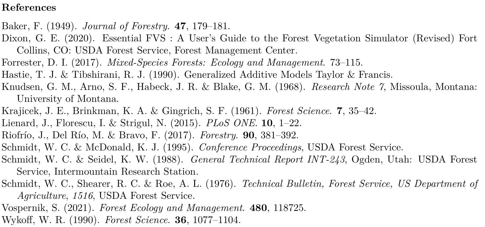

\vspace{-5truemm}

```{r setup, include=FALSE}
knitr::opts_chunk$set(echo = FALSE, warning = FALSE, message = FALSE)
cm.sq <- 6.4516
cm <- 2.54
source('12.gam_fns.R')
library(gratia)
library(grid)
library(gridExtra)
library(kableExtra)
library(patchwork)

hab_loc_codes <- read_csv('data/habtypes.csv')
hab_loc_codes <- hab_loc_codes %>% select(SETTING_ID, habclass, locationcode)

bai.train <- readRDS('data/bai.train.5_23_22.rds')
bai.train <- left_join(bai.train, hab_loc_codes, by = "SETTING_ID")

bai.size <- bai.train %>% 
  select(stand, MEASUREMENT_NO, PLOT, unique_tree_id, 
         bai, DIAMETER, treeba, log.diam, log.bai, grwth.yr) %>% 
  filter(bai != 0)

bai.site <- bai.train %>% 
  select(SETTING_ID, stand, MEASUREMENT_NO, myear, PLOT, cluster, unique_tree_id, 
         bai, DIAMETER, treeba, log.diam, log.bai, grwth.yr, mean_si, aspect_deg, 
         heatload, slope_deg, elev_m, NF, CROWN_RATIO, tpa.pl.all, tpa.pl.cutoff,
         ba.pl, bal.pl, ccf.pl, qmd.pl.all, qmd.pl.cutoff, dq.pl.all, dq.pl.cutoff, tpa.cl.all, tpa.pl.cutoff,
         ba.cl, ccf.cl, bal.cl, dq.cl.all, dq.cl.cutoff, HabType, habclass,
         locationcode) %>% 
  mutate(slope_pct = tan(slope_deg*(pi/180))*100, 
         asp_sin = sin(aspect_deg*(pi/180)),
         asp_cos = cos(aspect_deg*(pi/180))) %>%
  mutate(sl_asp_sin = asp_sin*slope_pct, 
         sl_asp_cos = asp_cos*slope_pct, 
         asp.trasp = trasp(aspect_deg), 
         HabType = as.factor(HabType),
         cr = CROWN_RATIO/100,
         bal.pl.ratio = bal.pl/ba.pl,
         unique_tree_id = factor(unique_tree_id)) %>% 
  filter(bai != 0)


bai.site.ids <- bai.site %>% group_by(stand) %>% 
  mutate(unique.stand = group_indices()) %>% ungroup() %>% 
  mutate(unique.cluster = (1000*unique.stand)+cluster, unique.plot = (1000*unique.stand)+PLOT) %>% 
  mutate(unique.cluster.meas = as.factor(unique.cluster + MEASUREMENT_NO), 
         unique.plot.meas = as.factor(unique.plot + MEASUREMENT_NO), 
         unique.cluster.f = as.factor(unique.cluster), 
         unique.plot.f = as.factor(unique.plot), 
         unique.tree.f = as.factor(unique_tree_id))


bai.spmx <- bai.train %>% 
  select(SETTING_ID, stand, MEASUREMENT_NO, myear, PLOT, cluster, unique_tree_id, 
         bai, DIAMETER, treeba, log.diam, log.bai, grwth.yr, mean_si, aspect_deg, 
         heatload, slope_deg, elev_m, NF, CROWN_RATIO, tpa.pl.all, tpa.pl.cutoff,
         ba.pl, bal.pl, ccf.pl, qmd.pl.all, qmd.pl.cutoff, dq.pl.all, dq.pl.cutoff, tpa.cl.all, tpa.pl.cutoff,
         ba.cl, ccf.cl, bal.cl, dq.cl.all, dq.cl.cutoff, HabType, habclass,
         locationcode, larch.ba.fraction.pl, shade.tol.pl, dom.spp.pl.ba) %>% 
  mutate(slope_pct = tan(slope_deg*(pi/180))*100, 
         asp_sin = sin(aspect_deg*(pi/180)),
         asp_cos = cos(aspect_deg*(pi/180))) %>%
  mutate(sl_asp_sin = asp_sin*slope_pct, 
         sl_asp_cos = asp_cos*slope_pct, 
         asp.trasp = trasp(aspect_deg), 
         HabType = as.factor(HabType),
         cr = CROWN_RATIO/100,
         bal.pl.ratio = bal.pl/ba.pl,
         unique_tree_id = factor(unique_tree_id)) %>% 
  filter(bai != 0)


bai.spmx.ids <- bai.spmx %>% 
  group_by(stand) %>% 
  mutate(unique.stand = group_indices()) %>%
  ungroup() %>% 
  mutate(unique.cluster = (1000*unique.stand)+cluster, 
         unique.plot = (1000*unique.stand)+PLOT) %>% 
  mutate(unique.cluster.meas = as.factor(unique.cluster + MEASUREMENT_NO), 
         unique.plot.meas = as.factor(unique.plot + MEASUREMENT_NO),
         unique.cluster.f = as.factor(unique.cluster), 
         unique.plot.f = as.factor(unique.plot), 
         unique.tree.f = as.factor(unique_tree_id)) %>% 
  filter(unique_tree_id != 15431)

a <- readRDS('data/model_objects.1/summary_re.tree.1')
b <- readRDS('data/model_objects.1/summary_spmx.re.gam.lf.rds')
c <- readRDS('data/model_objects.1/summary_spmx.re.gam.st.rds')

no.re.model <- readRDS('data/model_objects.1/site5a.2.rds')

re.tree.1 <- readRDS('data/model_objects.1/re.tree.1.rds')
spmx.re.gam.lf <- readRDS('data/model_objects.1/spmx.re.gam.lf.rds')
spmx.re.gam.st <- readRDS('data/model_objects.1/spmx.re.gam.st.rds')
nosize.base <- readRDS('data/model_objects.1/nosize.base.RDS')
nocomp.base <- readRDS('data/model_objects.1/nocomp.base.RDS')
nosite.base <- readRDS('data/model_objects.1/nosite.base.RDS')
size <- gam(bai~s(DIAMETER), family = 'Gamma'(link = log), data = bai.spmx.ids, method = 'ML') 
compd <- readRDS('data/model_objects.1/compd.pl4.rds')
site <- readRDS('data/model_objects.1/site.n5a.rds')

dev.expl <- function(model){(model$null.deviance-model$deviance)/model$null.deviance}

re.edf <- edf(re.tree.1)
lf.edf <- edf(spmx.re.gam.lf)
st.edf <- edf(spmx.re.gam.st)

lf.smest <- smooth_estimates(spmx.re.gam.lf, smooth = 's(larch.ba.fraction.pl)') %>% add_confint()

st.smest <- smooth_estimates(spmx.re.gam.st, smooth = 's(shade.tol.pl)') %>% add_confint()

f1a <- ggplot(lf.smest, aes(x = larch.ba.fraction.pl, y = exp(est))) + 
  geom_ribbon(alpha = 0.2, aes(ymin = exp(lower_ci), ymax = exp(upper_ci), x = larch.ba.fraction.pl)) + 
  geom_line() +
  labs(x = 'Larch proportion', y = NULL) +
  scale_y_continuous(breaks = seq(0.6, 2.15, by = 0.2)) + scale_x_continuous(n.breaks = 5) + geom_hline(yintercept = 1, linetype = 'dashed') +
  theme(axis.title = element_text(size = 8))
#shade tolerance
f1b <- ggplot(st.smest, aes(x = shade.tol.pl, y = exp(est))) +
  geom_ribbon(alpha = 0.2, aes(ymin = exp(lower_ci), ymax = exp(upper_ci), x = shade.tol.pl)) + 
  geom_line() +
  labs(x = 'Shade intolerance', y = NULL) +
  scale_y_continuous(breaks = seq(0.6, 2.15, by = 0.2)) +
  scale_x_continuous(n.breaks = 5) + geom_hline(yintercept = 1, linetype = 'dashed')+
  theme(axis.title = element_text(size = 8))


#draw(spmx.re.gam.lf, select = 1, rug = F, fun = function(x){cm.sq*exp(x)})
#fig 1
pgp_data_all <- readRDS('data/pgp_data_all.rds')

mdbh <- pgp_data_all %>% filter(SPECIES_SYMBOL == 'LAOC', TPA_EQUIV.pl != 0) %>% group_by(SETTING_ID, myear) %>% summarise(mean_diam = mean(DIAMETER, na.rm = T)) %>% ungroup() %>% group_by(SETTING_ID) %>% mutate(st.mean.d=mean(mean_diam)) %>% ungroup() %>% 
  mutate(cut = cut_number(st.mean.d, 3), 
         yrs = 
           case_when(myear < 1995 ~ 'early',
                     myear >= 1995 & myear < 2005 ~ 'mid',
                     myear > 2005 ~ 'late')) %>% 
  group_by(cut, yrs) %>% mutate(ctyr_dbh = mean(st.mean.d), ctyr_myr = mean(myear))

base.edf <- sum(re.edf$edf)
base.sz.edf <- re.edf$edf[1]
base.dcomp.edf <- sum(re.edf$edf[c(2,3,4)])
base.sit.edf <- sum(re.edf$edf[c(5,6)])
a$chi.sq

lf.alledf <- sum(lf.edf$edf)
lf.sz.edf <- lf.edf$edf[1]
lf.dcomp.edf <- sum(lf.edf$edf[c(2,3,4)])
lf.sit.edf <- sum(lf.edf$edf[c(5,6)])
lf.lf <- lf.edf$edf[8]

st.alledf <- sum(st.edf$edf)
st.sz.edf <- st.edf$edf[1]
st.dcomp.edf <- sum(st.edf$edf[c(2,3,4)])
st.sit.edf <- sum(st.edf$edf[c(5,6)])
st.st <- st.edf$edf[8]

figure1 <- ggplot(mdbh, aes(x = myear, y = mean_diam*2.54, group = SETTING_ID)) + geom_point(alpha = 0.9) + geom_line(alpha = 0.8) + labs(y = 'Stand mean diameter (cm)', x='Measurement year') +  theme(legend.position = 'none', plot.caption.position = 'plot', plot.caption = element_text(hjust = 0)) + theme_bw()

models <- c('Full model', 'Size', 'Comp.', 'Site', 'RE', 'WL ratio', 'Shade')
EDF <- c(base.edf, base.sz.edf, base.dcomp.edf, base.sit.edf, edf(re.tree.1, 's(unique_tree_id)')$edf, lf.lf, st.st)

dev <- c(deviance(re.tree.1), deviance(re.tree.1)-c(deviance(nosize.base), deviance(nocomp.base), deviance(nosite.base)), deviance(spmx.re.gam.lf), deviance(spmx.re.gam.st))

dev <- 100*c(dev.expl(re.tree.1), dev.expl(size), dev.expl(compd)-dev.expl(size), dev.expl(site)-dev.expl(compd), dev.expl(re.tree.1)-dev.expl(site), dev.expl(spmx.re.gam.lf), dev.expl(spmx.re.gam.st))

rmse.mods <- c(my.rmse.2(re.tree.1)[[2]]*cm.sq, rep(NA, 4), my.rmse.2(spmx.re.gam.lf)[[2]]*cm.sq, my.rmse.2(spmx.re.gam.st)[[2]]*cm.sq)

tb1 <- tibble(models, EDF, dev, rmse.mods) %>% rename('Model'= models, "EDF" = EDF,'Deviance Explained (%)'= dev, 'Model RMSE (cm\u00B2/yr.)' = rmse.mods)

kb1 <- tb1 %>% 
  kable(format = 'latex', booktabs = T, digits = c(1, 0, 2, 5), escape = T) %>% 
  kable_styling(latex_options = c('striped', 'hold_position'), full_width = T, font_size = 8, table.envir = 'float') %>% 
  group_rows('Species-mix', start_row = 6, end_row = 7) %>% 
  add_indent(c(2,3,4,5)) %>% 
  row_spec(1, bold = T) %>% 
  column_spec(1, width = '8em', latex_valign = 'm') %>% 
  column_spec(2, bold = ifelse(EDF > 1234, TRUE, FALSE), width = '4em', latex_valign = 'm') %>% 
  column_spec(3, bold = ifelse(dev > 80, T, F), width = '5em', latex_valign = 'm') %>% 
  column_spec(4, bold = T, width = '5em', latex_valign = 'm') %>% 
  gsub('NA', '', .)
```

### Introduction

Western larch (*Larix occidentalis*) is an important tree species that is 
exclusive to the inland northwest region of North America [@Knudsen1968; @Schmidt1976; @Schmidt1995]. 
It is very intolerant of shade, and grows across a wide range 
of communities with both shade-tolerant and -intolerant species [@Baker1949; @Schmidt1988]. 
A growing body of evidence suggests that species traits in mixed-species 
forest communities can impact tree growth relationships [@Forrester2017; @Riofrio2017]. 
Regional tree growth models like those used in the Forest Vegetation Simulator (FVS) [@Dixon2020] 
help evaluate management alternatives and aid in understanding how forests grow 
and change over time, but do not explicitly address community species 
composition impacts on tree growth. This study aims to evaluate 
if and how western larch growth varies across a range of species mixtures using 
a long-term data set distributed across forest 
lands in western Montana. The objectives of this research are: 
(i) to identify whether community species composition impacts the growth 
of western larch after accounting for other influential factors, 
(ii) to identify if a stand average shade-tolerance more effectively 
captures species-mixing effects on growth when compared to a less 
specific relative abundance metric, and (iii) to quantify the degree to which 
species-mixing impacts the growth of western larch (if an effect is observed).

\newfloatcommand{btabbox}{table}

\begin{figure}[H]\CenterFloatBoxes
  \begin{floatrow}
    \ffigbox{%
```{r figure1, include=T, fig.align='center', fig.width=2.5, fig.height=2.2}

figure1

```
}{% 
\caption{Average stand diameter for each measurement. Points connected with lines track individual PGP stands.}%
}
    \btabbox{%
```{r table1, include = T, fig.align='right', results='asis'}

kb1
  
``` 
    }{%
    \caption{Effective degrees of freedom (EDF), explained deviance, and RMSE for the base model, base model including larch proportion (WL ratio), and the base model including stand average shade-intolerance (Shade). EDF and deviance values are displayed for the full model and broken out by variable groups: size, competition and density (Comp.), site variables (Site), and random individual tree effects (RE). Explained deviance values for variable groups show the increase of percent deviance explained upon the inclusion of each group. Bold values represent full-model metrics and non-bold values represent variable group quantities.}%
    }
  \end{floatrow}
\end{figure}

### Methods

To establish a monitoring protocol for FVS, the USDA Forest Service 
developed a network of long-term permanent growth plot clusters (PGPs) 
in managed stands across northwest Montana. 
Various stand measurements were initialized and then remeasured at \~5 year 
increments between 1980 and 2002. The program was then paused, and was only 
recently revisited in 2018 and 2021, creating a long-term growth record (30-40 years) but reducing consistency of measurement intervals. Each PGP 
stand consists of 4 randomly located plot-clusters. 
Every cluster is comprised of three \~202$m^2$ large-tree, fixed-radius plots, 
with each plot containing three \~13.5 $m^2$ small-tree fixed-radius sub-plots. 
Data from 18 of these stands were used in this study and comprise 2,381 
unique western larch trees traced over time. 
Tree size varied across stands and over time as seen in Fig. 1. 
Data from two plots out of each stand were withheld prior to model-fitting for the purpose of validation.

With these data, an individual tree basal area increment (BAI) model was developed using 
a generalized additive mixed model (GAMM) approach. 
Explanatory variables considered in the model were grouped together 
based on the attributes they represent: tree size, stand density, 
competition, and site characteristics [@Wykoff1990; @Vospernik2021]. 
Variables were compared and selected within each group based on their contributions
to model accuracy and fit to establish a base model. 
Random individual tree effects were incorporated into this base model to account for remeasurement. 
Then, variables describing the degree and/or form of stand species-mixture were added to 
the model and their contributions to model accuracy and performance were assessed. 
Two species-mixing variables were considered: a proportion of stand basal 
area taken up by larch as well as a stand shade-intolerance metric, 
where a shade tolerance index [@Lienard2015] was used to weight each
species' proportion of stand basal area by shade tolerance.


### Results \& Discussion

Various alternative base model formulations for estimating BAI were considered. 
Ultimately, tree diameter at breast height (DBH) was selected in the size group; 
crown competition factor [CCF; Krajicek -@Krajicek1961], basal area larger than the subject tree (BAL), and 
crown ratio (CR) were selected in the competition and density group; 
slope and aspect were selected in the site group. Out of all *individual* variables selected, 
DBH contributed the most to estimating BAI, and the nonlinear 
relationship identified here resembled previously identified parametric relationships 
between DBH and BAI [@Wykoff1990; @Vospernik2021]. 
By group, competition and density variables contributed the largest share of explained deviance, 
likely due to it holding the most variables (Table 1). 
Both species-mixing terms improved model accuracy and fit (deviance explained), 
where model accuracy was improved more by the 
larch proportion term and model fit was better when shade-tolerance was accounted for. 
Both terms also displayed a negative association with 
BAI (Fig.2), meaning that as the proportion of larch or the proportion of other 
shade intolerant species increased, larch BAI decreased, 
given that all other factors remain constant. 
However, the partial effect on BAI of the shade intolerance index term was 
smaller and its curve was less stable than that of the proportion of western larch term, 
and was not as precisely estimated (Fig. 2). 
Their additions to the base-model did not greatly modify or overlap with the effects of 
any other variables such as by an inflation of concurvity [@Hastie1990] or perturbation of fitted smooth-relationships.

This work is ongoing, and thus more results are to come. 
For instance, the withheld data will be used to assess the 
ability to generalize the effects identified by this model. 
Further, the portion of the PGP data set used here contains growth
records for Douglas-fir (*Pseudotsuga menzesii*) and subalpine fir (*Abies lasiocarpa*), both of which 
are more shade-tolerant than western larch. 
By replicating these analyses on tree species across 
the shade-tolerance spectrum, we will identify whether 
community composition effects vary across species, and evaluate the relative 
impact of species-mixing on tree growth in select forest ecosystems of the inland northwest. 


\begin{figure}[H]
\begin{floatrow}
\ffigbox{%
\caption{Partial response curves for each respective species-mixing model term and its effect on BAI. WL ratio represents the stand proportion of western larch, and Shade represents the stand average shade-intolerance. The partial effect is multiplicative on estimated BAI, and thus the horizontal dashed line represents a threshold of positive/negative effects.}}%
{%
```{r figure2, include = T, fig.align='left', fig.dim=c(3, 1.5)}
limits <- c(0.8, 2.15)
breaks <- seq(limits[1], limits[2], by = 0.2)

f1a <- ggplot(lf.smest, aes(x = larch.ba.fraction.pl, y = exp(est))) + 
  geom_ribbon(alpha = 0.2, aes(ymin = exp(lower_ci), ymax = exp(upper_ci), x = larch.ba.fraction.pl)) + 
  geom_line() +
  geom_hline(yintercept = 1, linetype = 'dashed') + scale_y_continuous(limits = limits, breaks = breaks) +
  labs(y = 'Partial effect', x = 'WL ratio')
#shade tolerance
f1b <- ggplot(st.smest, aes(x = shade.tol.pl, y = exp(est))) +
  geom_ribbon(alpha = 0.2, aes(ymin = exp(lower_ci), ymax = exp(upper_ci), x = shade.tol.pl)) + 
  geom_line() +
  geom_hline(yintercept = 1, linetype = 'dashed') + scale_y_continuous(limits = limits, breaks = breaks) +
  theme(axis.ticks.y = element_blank(), axis.text.y = element_blank(), axis.title.y = element_blank()) +
  labs(x = 'Shade')

f1aa <- ggplot_gtable(ggplot_build(f1a))
f1bb <- ggplot_gtable(ggplot_build(f1b))

f1bb$heights <- f1aa$heights

grid.arrange(f1aa, f1bb, ncol = 2)

```
}
\ffigbox{%
```{r, include=T, fig.align='right', fig.dim=c(3, 2.1), dpi=400}

```
}{}
\end{floatrow}
\end{figure}
\newpage

### References


